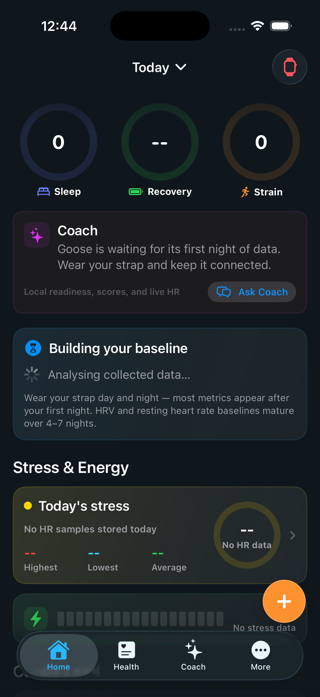

> **Disclaimer — Unofficial Project / Personal Data Research**
>
> Goose is an independent, unofficial project not affiliated with, endorsed by, or supported by WHOOP, Inc. This project accesses biometric data exclusively over Bluetooth Low Energy from the user's own hardware — it does not touch WHOOP's servers or APIs. It was built for personal research and data portability purposes only, grounded in GDPR Art. 20 (right to data portability) and EU Directive 2009/24/EC Art. 6 (interoperability exception).
>
> See [DISCLAIMER.md](DISCLAIMER.md) for the full legal statement.

<p align="center">
  
</p>

<h1 align="center">Goose</h1>

<p align="center"><b>Your strap. Your data. Your phone. BLE-direct, self-hosted, no cloud.</b></p>

<p align="center"><sub>Active fork of <a href="https://github.com/b-nnett/goose">b-nnett/goose</a> — expanded with a Rust metrics core, self-hosted server, and full health dashboard.</sub></p>

<p align="center">
  
  
  
  
  <a href="LICENSE"></a>
  <a href="https://discord.gg/EyZE6gzAF2"></a>
</p>

<p align="center">
  <a href="#features">Features</a> ·
  <a href="#requirements">Requirements</a> ·
  <a href="#build">Build</a> ·
  <a href="#self-hosted-server">Self-Hosted Server</a> ·
  <a href="#contributing">Contributing</a> ·
  <a href="https://discord.gg/EyZE6gzAF2">💬 Discord</a>
</p>

<p align="center">
  
  &nbsp;&nbsp;
  
  &nbsp;&nbsp;
  
</p>
<p align="center"><sub>Today · Health · Sleep — all data processed locally, nothing leaves the device by default.</sub></p>

---

**Alpha proof of concept.** This build is for developers evaluating whether a project of this scope is viable. It is not ready for tracking personal health data in production. If you don't know what Xcode is or how to build a Rust library, wait for the TestFlight beta.

## Features

- **Home** — daily overview: sleep score, recovery, strain rings, live HR, stress & energy summary.
- **Health** — detail surfaces for Sleep, Recovery, Strain, Stress, Cardio Load, Energy Bank, Health Monitor, and Algorithms.
- **Coach** — local AI coach that reads your on-device metrics; no data leaves the app.
- **BLE sync** — CoreBluetooth direct-connect to WHOOP 5.0, WHOOP 4.0, and WHOOP MG; background sync; historical packet import.
- **Rust core** — protocol parsing, SQLite persistence, and metric algorithms compiled as a static library (`libgoose_core.a`).
- **HealthKit export** — HR, SpO2, HRV, and sleep sessions written to Apple Health after each sync.
- **Self-hosted server** (optional) — FastAPI + TimescaleDB backend; automatic upload from iOS; Docker Compose setup.
- **Workout Live Activity** — Dynamic Island and lock-screen widget during workouts.

## Requirements

- macOS with Xcode (iOS 26.0 SDK).
- Rust and Cargo (MSRV 1.96) with iOS targets installed via `rustup`.
- Apple Developer signing configured for your bundle identifier (override via `Config/Local.xcconfig`).
- Docker (optional — only needed for the self-hosted server).

iOS 26.0 device or simulator. The Rust `.a` archives are gitignored and built automatically by the Xcode build phase; a fresh clone needs at least one build to populate them.

## Build

```bash
git clone https://github.com/tigercraft4/goose.git
cd goose
```

Install iOS Rust targets:

```bash
rustup target add aarch64-apple-ios aarch64-apple-ios-sim x86_64-apple-ios
```

Open `GooseSwift.xcodeproj` in Xcode and run the `GooseSwift` scheme, or build from the command line:

```sh
# Simulator
xcodebuild \
  -project GooseSwift.xcodeproj \
  -scheme GooseSwift \
  -destination 'platform=iOS Simulator,name=iPhone 17' \
  -derivedDataPath /tmp/goose-swift-deriveddata \
  build

# Physical device
xcodebuild \
  -project GooseSwift.xcodeproj \
  -scheme GooseSwift \
  -destination 'platform=iOS,id=<device-id>' \
  -derivedDataPath /tmp/goose-swift-deriveddata-device \
  -allowProvisioningUpdates \
  build
```

After a device build, reinstall:

```sh
xcrun devicectl device install app \
  --device <device-id> \
  /tmp/goose-swift-deriveddata-device/Build/Products/Debug-iphoneos/GooseSwift.app

xcrun devicectl device process launch \
  --device <device-id> --terminate-existing \
  com.goose.app
```

## Self-Hosted Server

The `server/` directory is an optional FastAPI + TimescaleDB backend. The iOS app works standalone without it.

```bash
cd server
cp .env.example .env
# Edit: set GOOSE_API_KEY and GOOSE_DB_PASSWORD
docker compose up -d --build
```

Verify: `curl -s localhost:8770/healthz` → `{"status":"ok"}`

Configure the server URL and Bearer token in the iOS app under **More → Server Settings**. See `server/README.md` for the full API reference.

## Rust Core Bridge

The Rust source is committed at `Rust/core`. Do not commit built `.a` archives; the Xcode build phase generates them via `Scripts/build_ios_rust.sh`.

Manual build if needed:

```bash
# Simulator (Apple Silicon)
PLATFORM_NAME=iphonesimulator CURRENT_ARCH=arm64 Scripts/build_ios_rust.sh

# Physical iPhone
PLATFORM_NAME=iphoneos CURRENT_ARCH=arm64 Scripts/build_ios_rust.sh
```

Set `GOOSE_SKIP_RUST_CORE_BUILD=1` to skip recompilation on subsequent Xcode builds.

## Data and Privacy

All metric computation and storage is local. BLE packet bytes go through the Rust core into SQLite on the device. The self-hosted server upload is opt-in and controlled from **More → Server Settings**. Coach responses use the same local metric summaries visible in the app — no network request is made unless you configure a server or enable the AI coach provider.

## Independence

Goose is independent of WHOOP. This repository does not include or reference code owned by WHOOP. The app communicates with WHOOP bands over Bluetooth using services and data exposed by the device, then parses and stores that local data through the Goose Rust core. Product names are used only to describe compatibility.

## Acknowledgements

Built on [b-nnett/goose](https://github.com/b-nnett/goose) for the iOS shell and BLE/Rust architecture. BLE pairing patterns draw from [Noop](https://github.com/NoopApp/noop). The self-hosted server adapts [tigercraft4/my-whoop](https://github.com/tigercraft4/my-whoop). Health metric UI design references [Bevel](https://www.bevel.health/).

## Contributing

Small, focused changes are easiest to review. See [CONTRIBUTING.md](CONTRIBUTING.md) for code style, Rust bridge conventions, and the PR checklist. Join [Discord](https://discord.gg/EyZE6gzAF2) or [GitHub Discussions](https://github.com/tigercraft4/goose/discussions) for questions.

## License

PolyForm Noncommercial License 1.0.0. See [LICENSE](LICENSE).
